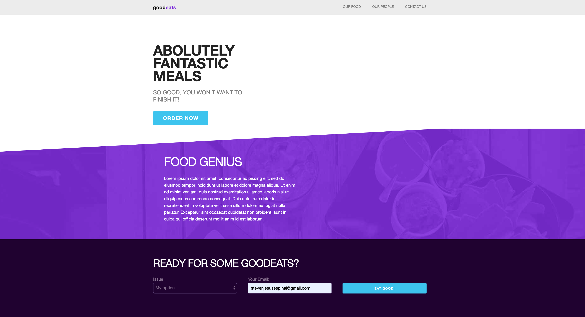

# LandingPage
Responsive landing page layout using skeleton css &amp; html.

(images/responsive.png)

# Steps to reproduce this application to your local machine:
1. Simply clone this repo on your desktop either using SSH or HTTPS
2. Open the cloned folder in your text editor of choice (mine happens to be WebStorm)
3. After it is loaded up onto your editor, simply open the html file and hover over the hyperlinks!
